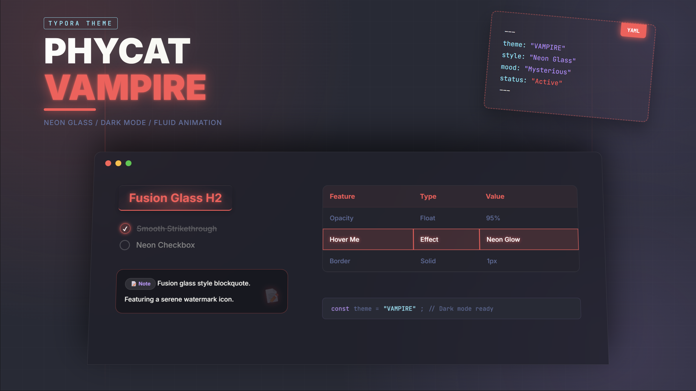
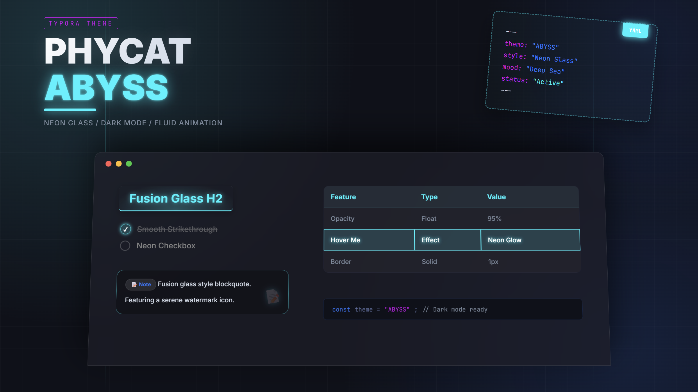

# Phycat theme for Typora

> 好看的样式可以提升写作体验。

Phycat-color亮色主题系列2.0发布后受到大量用户的喜爱！不少朋友期待暗色主题会调整发布吗？现在它来了！请允许我隆重向大家介绍，Phycat暗色系列主题——**Phycat-neon**（霓虹）。

顾名思义，**Phycat-neon**（霓虹）的设计元素为暗夜、线条、光影、毛玻璃、灯带。这些元素碰撞在一起让这款暗色系主题尤为好看！

这次暗色系主题带来三款配色，分别是**Vampire(吸血鬼)**、**Radiation（辐射）**、**Abyss（深渊）**，对应红色、绿色、蓝色。其中我最喜欢的是**Vampire(吸血鬼)**，强烈推荐。

如果你喜欢这套主题，可以选择打赏支持。不胜感激！


大家依然可以点击下面的链接进行样式预览，我希望你知道，这些全都是再Typora中直接导出的HTML文件！

| 主题系列            | 主题链接                                                     |
| ------------------- | :----------------------------------------------------------- |
| 亮色系主题**Color** | [Cheey（樱桃红）](https://sumruler.github.io/typora-theme-phycat/demo-cherry.html)、[Caramel（焦糖橙）](https://sumruler.github.io/typora-theme-phycat/demo-caramel.html)、[Forest（森绿）](https://sumruler.github.io/typora-theme-phycat/demo-forest.html)、[Mint（薄荷青）](https://sumruler.github.io/typora-theme-phycat/demo-mint.html)、[Sky（天蓝）](https://sumruler.github.io/typora-theme-phycat/demo-sky.html)、[Prussian（普鲁士蓝）](https://sumruler.github.io/typora-theme-phycat/demo-prussian.html)、[Sakura（樱花粉）](https://sumruler.github.io/typora-theme-phycat/demo-sakura.html)[Mauve（淡紫）](https://sumruler.github.io/typora-theme-phycat/demo-mauve.html) |
| 暗色系主题**Neon**  | [Vampire(吸血鬼)](https://sumruler.github.io/typora-theme-phycat/demo-vampire.html)、[Radiation（辐射）](https://sumruler.github.io/typora-theme-phycat/demo-radiation.html)、[Abyss（深渊）](https://sumruler.github.io/typora-theme-phycat/demo-abyss.html) |






## 设计语言

- **清晰**、**分明**、**简洁**、**暗夜**、**线条**、**光影**、**毛玻璃**、**灯带**

- 字体：霞骛文楷
- 卡片风格：*光影*、*毛玻璃*、*灯带*

## 主题特点

1. **美观**：*好看的样式可以提升写作体验* ✍️。

2. **分明**：标题、列表、大纲都进行了精心设计，标题一眼就能看出是几级标题，列表、大纲目录层级非常**分明易读** 。

3. **灵动**：精心设计了大量动画效果——**Hover动画** ✨、**任务列表**完成动画等等 ✅。在给你一些小惊喜的同时不影响布局，只增强阅读与编辑体验 ⚖️。

4. **细节**：大纲目录后跳动的星星 🌟、超链接转动的小图标 🔗、代码块右上角的代码语言 💻、为 Yaml、KBD 键盘专门书写的样式 ⌨️、多套背景样式、PDF 导出样式优化等等，处处都有**小巧思** 💡。

5. **导出 HTML 深度优化**：导出的 HTML 完美兼容软件内样式 🌐，大纲目录样式也进行了深度优化设计。样式预览页面都是直接导出的 HTML 页面，相信你看了会喜欢的 ❤️。

6. **配色丰富且易定制**🎨：
    配色文件与样式文件分离，复制一份即可轻松修改。**如果不会搭配，也可以让 AI 生成一套好看的配色** 🤖。
   
7. **便捷功能开关**：在配色 CSS 文件中，可以通过简单调整快速启用或改变**背景样式**、**自动编号**等功能 ⚙️。

## 样式预览

点击链接预览即可，都是直接通过Typora导出的HTML文件

| 主题系列            | 主题链接                                                     |
| ------------------- | :----------------------------------------------------------- |
| 亮色系主题**Color** | [Cheey（樱桃红）](https://sumruler.github.io/typora-theme-phycat/demo-cherry.html)、[Caramel（焦糖橙）](https://sumruler.github.io/typora-theme-phycat/demo-caramel.html)、[Forest（森绿）](https://sumruler.github.io/typora-theme-phycat/demo-forest.html)、[Mint（薄荷青）](https://sumruler.github.io/typora-theme-phycat/demo-mint.html)、[Sky（天蓝）](https://sumruler.github.io/typora-theme-phycat/demo-sky.html)、[Prussian（普鲁士蓝）](https://sumruler.github.io/typora-theme-phycat/demo-prussian.html)、[Sakura（樱花粉）](https://sumruler.github.io/typora-theme-phycat/demo-sakura.html)[Mauve（淡紫）](https://sumruler.github.io/typora-theme-phycat/demo-mauve.html) |
| 暗色系主题**Neon**  | [Vampire(吸血鬼)](https://sumruler.github.io/typora-theme-phycat/demo-vampire.html)、[Radiation（辐射）](https://sumruler.github.io/typora-theme-phycat/demo-radiation.html)、[Abyss（深渊）](https://sumruler.github.io/typora-theme-phycat/demo-abyss.html) |

## 使用方法

1. 从[Releases · sumruler/typora-theme-phycat](https://github.com/sumruler/typora-theme-phycat/releases)下载最新的主题包

2. 将`phycat`文件夹与所有CSS文件放进Typora主题目录下
   复制下面内容，WIN+R运行即可快速打开

   ```bash
   %appdata%\Typora\themes
   ```

3. 重启Typora，在主题中启用相应主题即可

## 常见问题

### 导出网页如何具有侧边栏大纲

在偏好设置，找到导出，选择HTML，勾选保留侧边栏大纲

### 如何开启自动编号

在配色CSS文件中（例如phycat-forest.css)，取消注释对应的自动编号级别即可

### 如何开启或更换背景图案

在配色CSS文件中（例如phycat-forest.css)，更改`--bg-style`变量即可

## 打赏

如果你喜欢这套主题，可以选择打赏支持。不胜感激！


