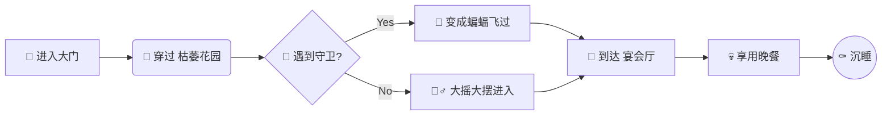

# 🧛‍♂️ 德古拉的午夜邀约

如果你喜欢这套主题，可以选择打赏支持。不胜感激！


| 主题系列            | 主题链接                                                     |
| ------------------- | :----------------------------------------------------------- |
| 亮色系主题**Color** | [Cheey（樱桃红）](https://sumruler.github.io/typora-theme-phycat/demo-cherry.html)、[Caramel（焦糖橙）](https://sumruler.github.io/typora-theme-phycat/demo-caramel.html)、[Forest（森绿）](https://sumruler.github.io/typora-theme-phycat/demo-forest.html)、[Mint（薄荷青）](https://sumruler.github.io/typora-theme-phycat/demo-mint.html)、[Sky（天蓝）](https://sumruler.github.io/typora-theme-phycat/demo-sky.html)、[Prussian（普鲁士蓝）](https://sumruler.github.io/typora-theme-phycat/demo-prussian.html)、[Sakura（樱花粉）](https://sumruler.github.io/typora-theme-phycat/demo-sakura.html)[Mauve（淡紫）](https://sumruler.github.io/typora-theme-phycat/demo-mauve.html) |
| 暗色系主题**Neon**  | [Vampire(吸血鬼)](https://sumruler.github.io/typora-theme-phycat/demo-vampire.html)、[Radiation（辐射）](https://sumruler.github.io/typora-theme-phycat/demo-radiation.html)、[Abyss（深渊）](https://sumruler.github.io/typora-theme-phycat/demo-abyss.html) |

> **致 尊贵的来宾：**
>
> 当钟声敲响第十二下，月亮染上猩红之时，我诚挚地邀请您光临寒舍。这不仅仅是一场晚宴，更是一场 **视觉的盛宴**。在这里，你可以看到光影如何在黑暗中起舞。

## 1. 🦇 入堡须知 (The Rules)

在进入城堡之前，请务必阅读以下 **高亮条款**。我们不希望发生任何<mark>“意外”</mark>（比如被当作晚餐）。

请注意，按下 <kbd>Ctrl</kbd> + <kbd>Shift</kbd> + <kbd>L</kbd> 并不能让你在现实中隐身。

### 1.1 禁忌物品清单

- [ ] **大蒜** (Garlic) - *已没收，气味太重了。*

- [ ] **银质十字架** (Silver Cross) - *已熔化。*

- [x] **木桩** (Wooden Stake) - *请自觉上交。*

- [x] **圣水** (Holy Water) - *这里只提供 1882 年的红酒。*

## 2. 🍷 晚宴菜单 (The Menu)

我们的厨师为您精心准备了以下菜肴。请注意观察表格的 **融合毛玻璃 (Fusion Glass)** 质感与悬停时的 **霓虹光晕**。

| 菜品编号 | 菜名 (Dish) | 血型 (Type) | 稀有度 (Rarity) | 备注 (Notes)                 |
| -------- | ----------- | ----------- | --------------- | ---------------------------- |
| **A-01** | 猩红玛丽    | O-          | ⭐⭐              | *口感醇厚，回味甘甜*         |
| **B-03** | 伯爵特调    | AB+         | ⭐⭐⭐⭐            | *仅限 VIP，产自维多利亚时代* |
| **C-07** | 月光凝露    | RH-         | ⭐⭐⭐⭐⭐           | *极其罕见，请细细品尝*       |
| **D-09** | 幽灵布丁    | ?           | ⭐               | *看起来透明，吃起来更透明*   |

## 3. 🕸️ 城堡导航 (Navigation)

迷路了吗？请参考下方的全息地图。这是使用了 **Fusion Neon** 配色的 Mermaid 流程图。



## 4. 📜 古老咒语 (The Code)

为了唤醒沉睡的侍从，你需要运行以下代码。请欣赏 **Mac 风格窗口** 与 **主题色微光边框** 的完美结合。

```JAVA
class Vampire(Undead):
    def __init__(self, name, age):
        self.name = name
        self.age = age
        self.is_thirsty = True

    def drink_blood(self):
        """
        Attempts to satisfy thirst.
        WARNING: Do not drink from werewolves.
        """
        if self.is_thirsty:
            print(f"{self.name} sips the crimson wine...")
            self.is_thirsty = False
            return "Satisfied"
        else:
            return "Not thirsty yet"

# 实例化德古拉
dracula = Vampire("Vladimir", 597)
status = dracula.drink_blood()
print(f"Status: {status}")
```

## 5. ⚠️ 警示与备注 (Alerts)

在城堡中行走，请留意墙上的这些发光告 示。

> [!TIP]  
> 请勿在走廊奔跑，我们的地毯很贵，而且可能会滑倒摔进陷阱。

> [!WARNING]  
> 午夜 3 点后请勿照镜子。不是因为有鬼，是因为你会发现镜子里没有自己。

> [!IMPORTANT]  
> 地下室的棺材不是用来睡觉的，那是我的收藏品展示柜。

## 6. 结语 (Epilogue)

希望您喜欢今晚的安排。如果您喜欢 **Vampire 主题** 的细节，您可以打赏支持该款主题的作者，伯爵将不胜感激！


*P.S. 离开时请不要带走任何 **蝙蝠**，它们是有编制的员工。*