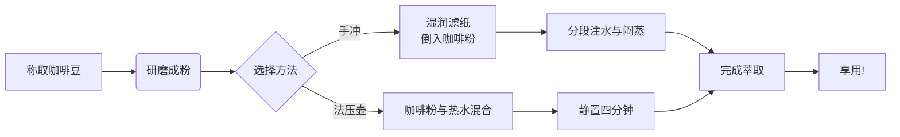

# ☕ 咖啡的炼金术：一则关于专注与偶然的样式测试文档

如果你喜欢这套主题，可以选择打赏支持。不胜感激！


| 主题系列            | 主题链接                                                     |
| ------------------- | :----------------------------------------------------------- |
| 亮色系主题**Color** | [Cheey（樱桃红）](https://sumruler.github.io/typora-theme-phycat/demo-cherry.html)、[Caramel（焦糖橙）](https://sumruler.github.io/typora-theme-phycat/demo-caramel.html)、[Forest（森绿）](https://sumruler.github.io/typora-theme-phycat/demo-forest.html)、[Mint（薄荷青）](https://sumruler.github.io/typora-theme-phycat/demo-mint.html)、[Sky（天蓝）](https://sumruler.github.io/typora-theme-phycat/demo-sky.html)、[Prussian（普鲁士蓝）](https://sumruler.github.io/typora-theme-phycat/demo-prussian.html)、[Sakura（樱花粉）](https://sumruler.github.io/typora-theme-phycat/demo-sakura.html)[Mauve（淡紫）](https://sumruler.github.io/typora-theme-phycat/demo-mauve.html) |
| 暗色系主题**Neon**  | [Vampire(吸血鬼)](https://sumruler.github.io/typora-theme-phycat/demo-vampire.html)、[Radiation（辐射）](https://sumruler.github.io/typora-theme-phycat/demo-radiation.html)、[Abyss（深渊）](https://sumruler.github.io/typora-theme-phycat/demo-abyss.html) |

隆重介绍物理猫Phycat主题色工坊，点击>>[Phycat Theme Studio](https://sumruler.github.io/typora-theme-phycat/phycat-theme-studio.html)<<一键生成你的专属主题配色！

[toc]

> “我们并非在饮用咖啡，而是在饮用理念。” —— 某位在咖啡馆沉思的匿名者

这篇文档旨在展示 **Markdown** 近乎无限的表现力。我们将借由“制作一杯完美咖啡”的隐喻，探索从混沌的豆粒到清澈灵感的全过程。请观察，这里不仅是格式的演示，也是一场微型的思维实验。

---

## 第一部分：基础要素 —— 咖啡豆的哲学

每一颗咖啡豆都蕴含着一个世界。要释放它，我们需要以下**核心原则**：

1.  **优质原料**：这是风味的基石。
    *   *产地*：埃塞俄比亚的耶加雪菲（花香）、哥伦比亚的蕙兰（坚果巧克力）。
    *   *处理法*：水洗（清澈）、日晒（醇厚）、蜜处理（甜美）。
2.  **精确的变量**：咖啡是科学与艺术的交界点。
    *   研磨度（从粗盐到面粉）
    *   水温（92°C - 96°C 的黄金区间扽黄`okoko`我仍三
    *   水粉比（例如 **1:15**）
    *   时间（萃取不足与过萃的拉锯战）

### 一个简单的冲煮思路流程图



## 第二部分：操作指南 —— 手冲的仪式感

以下是一个经典**V60手冲**步骤，它体现了秩序与即兴的结合：

1.  **预热**：用热水冲洗滤纸和滤杯，同时温热分享壶。
2.  **布粉**：将研磨好的咖啡粉倒入滤杯，轻轻拍平。
3.  **闷蒸**：
    - 注入两倍于咖啡粉重量的热水。
    - 等待 **30秒**，观察咖啡粉层是否像“呼吸”一样膨胀鼓起。
        - ✅ 成功：均匀的鼓包，说明咖啡新鲜，萃取均匀。
        - ❌ 失败：局部塌陷，可能导致后续通道效应。
4.  **注水**：以小圈到中圈的方式缓慢注入剩余热水，总时间控制在 **2分钟至2分30秒**。

> **技术注记**：闷蒸的目的在于排出二氧化碳，使后续热水能有效接触咖啡粉细胞壁，进行萃取。这是**科学**的部分。而注水的手法和节奏，则是**艺术**的开始。

## 第三部分：数据与对比 —— 器材的理性选择

咖啡的呈现方式多样，下表对比了三种常见方法的特性：

| 冲煮方法                  | 所需器材           | 风味特点                     | 难度系数 | 适合场景               |
| :------------------------ | :----------------- | :--------------------------- | :------- | :--------------------- |
| **手冲 (Pour-Over)**      | 滤杯、滤纸、手冲壶 | 干净、层次分明、突出风味细节 | ⭐⭐⭐⭐     | 独自品味、追求仪式感   |
| **法压壶 (French Press)** | `法压壶`           | 饱满、醇厚、带有油脂感       | ⭐⭐       | 多人分享、喜爱浓郁口感 |
| **爱乐压 (AeroPress)**    | 爱乐压、滤纸       | 口感干净且浓郁、玩法多变     | ⭐⭐⭐      | 旅行、办公室、快速出品 |

## 第四部分：萃取的代码隐喻

咖啡萃取，本质上是一个物质传递的过程。我们可以用一段伪代码来抽象这一逻辑：

```python
# coffee_extraction.py
class PerfectCup:
    def __init__(self, beans, water, method="v60"):
        self.beans = beans  # 咖啡豆对象
        self.water = water  # 水对象（包含温度、硬度属性）
        self.method = method
        self.tds = 0.0  # 总溶解固体浓度
        self.ey = 0.0   # 萃取率

    def brew(self):
        """执行冲煮的核心算法"""
        grind_size = self._adjust_grind() # 根据方法调整研磨度
        bloom_success = self._bloom()     # 闷蒸，返回布尔值

        if bloom_success:
            extraction_time = self._control_pour() # 控制注水
            self.tds = self._measure_tds() # 测量浓度
            self.ey = self._calculate_ey() # 计算萃取率

            if 18 <= self.ey <= 22: # 黄金萃取率区间
                return "🎉 完美！这杯咖啡在最佳萃取窗口内。"
            elif self.ey < 18:
                return "⏳ 萃取不足，可能偏酸、单薄。"
            else:
                return "🔥 过萃了，可能带有焦苦味。"
        else:
            return "❌ 闷蒸失败，请检查咖啡豆新鲜度或注水方式。"

# 实例化并运行
my_morning_cup = PerfectCup(beans="Ethiopia Yirgacheffe", water="92C")
result = my_morning_cup.brew()
print(result)
```

## 第五部分：超越杯子 —— 咖啡与生活

一杯好咖啡的影响，远不止于味蕾。

*   **它是专注的锚点**：在研磨、注水的几分钟里，世界被简化为水流的弧线与时间的流逝。
*   **它是连接的桥梁**：“一起喝杯咖啡”是现代社会中一种温和的社交契约。
*   **它是灵感的催化剂**：多少思绪在咖啡因的轻抚下变得清晰，多少对话在杯沿的热气中得以深入。

<q class="page-break"/>

---

### 最后的提醒（或免责声明）

> ⚠️ **请注意**：本文档中关于咖啡的所有描述，都源于作者的主观体验与广泛阅读。咖啡的**终极奥义**在于你的个人偏好。如果你喜欢加糖、加奶，或者就爱喝速溶咖啡，那也完全正确。所有关于“完美”的探讨，其目的都是为了**增进体验的乐趣，而非设立品味的藩篱**。

> [!TIP]  
> 咖啡如果觉得苦，可以加点糖。

> [!WARNING]  
>
> 咖啡会导致胃酸分泌多，肠胃不好少喝咖啡哦！

> [!NOTE]  
> 咖啡和牛奶是很好的搭配呢。

> [!IMPORTANT]  
> 未成年不建议喝咖啡呢！
